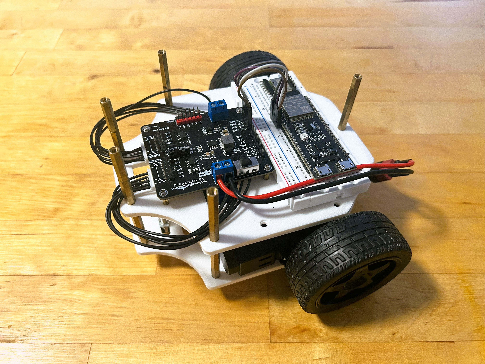

# Dev Update \#2

This week we continue the development of our "ddbot" robot project.

**Progress**: we have build up the second layer of chassis for the robot, as shown below. 

We select a dual-channel DC motor drive module to drive two motors simultaneously and provide useful voltage outputs like 3.3V, 5V for other modules. We choose ESP32 as the microcontroller, which provides low-level interfaces such as I2C, SPI, PWM, etc. It can control devices with these interfaces, e.g. PWM for adjusting motor speed, I2C for reading IMU data. An 6-axis IMU sensor is included to measure car's attitude. For easy setup and flexibility, we use a breadboard for wire connections for now.

**Plan**: for the next week, we try to set up the third layer of the chassis, adding a camera module for vision-based tasks an a Pi (a.k.a. single board computer) for high-level central control. If time permits, we will add the fouth layer to include a 2D Lidar as well. Stay tuned...