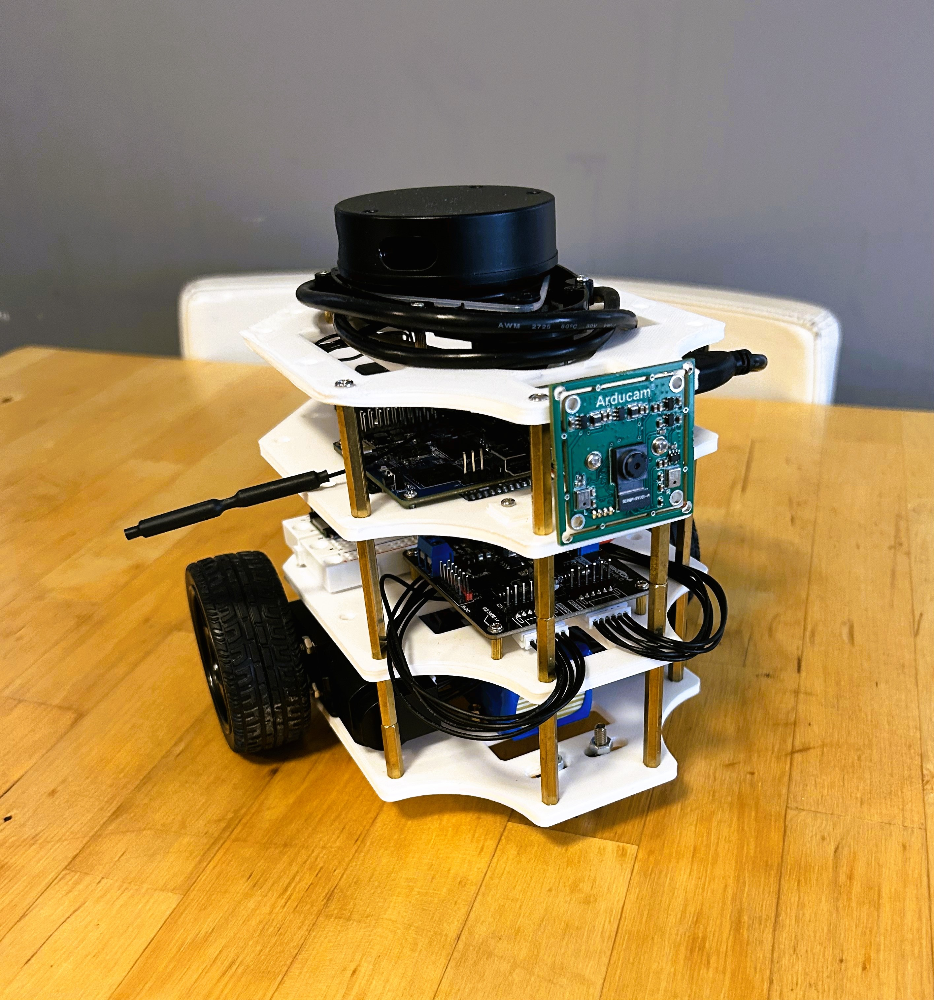

# Weekly Update \#3

This week we basically finish up building the hardware for the whole "ddbot" robot, including the third and fourth layer of its chassis.

**Progress**: On the third layer, we add a OrangePi 3 LTS as the high-level central controller responsible for managing all peripherals, including sensors, and coordinating with other modules such as the ESP32 located on the second layer. It runs a modified verison of Linux Ubuntu operating system. Moreover, we attach a 8MP USB video camera (UVC) module on this layer at the very front of the robot body. This is required for all vision-based tasks. On the fourth layer, we add a Time-of-Flight (ToF)-based 2D LiDAR at the top for scanning the distance of nearby environment. This is useful for projects such as SLAM and collision avoidance. The robot is shown in the image below.
 

**Plan**: Over the following weeks, we shift the foucs to software development, from verifying all hardware modules to adding sevaral AI-based projects and their tutorials. In terms of the software proramming language, we will choose Python as it is widely used in AI & deep learning community and is easy to learn. Specifically, we will use Python within the Linux OS on the OrangePi and use its micro-controller version, named CircuitPython, on the ESP32. 
