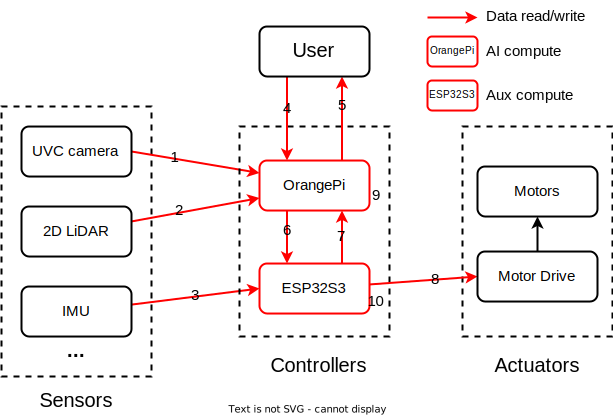

# Dev Update \#4

After a brief delay, we resume the development of ddbot, mainly focusing on software. To pointout where the software utilities are needed, we show a scatch of system structure here. The numbered arrows and blocks in red are where software should cover. These numbers help as reference to track the development status of each software component and are used below as [x] to match specific functionality.

.

**Progress**: We have developed and tested the software for several functionalities, including the wireless video streaming of UVC camera [1,5], the UART communication between Orangepi and ESP32 [6,7], a terminal UI-based control panel [4], and a simple motor control [8].

Video streaming enables wireless, real-time visualization of the ddBot camera view on a webpage, facilitating remote FPV control. UART communication facilitates high- to low-level device information exchange, allowing the Orangepi to process compute-extensive AI tasks like image classification via deep learning, with its results sent to the ESP32 to control low-level hardware like motors. The terminal UI-based control panel offers users an easy way to control robot movement via terminal programs and keyboard inputs. Additionally, we do full voltage motor control using H-bridge mode. That works but leads to rapid movement and collision, causing the motor drive board burned up. We show the demos of these functions as follows.

*Wireless camera video streaming*

*UART communication between Pi and ESP32: Pi send, ESP32 receive*

*UART communication between Pi and ESP32: Pi receive, ESP32 send*

*Terminal UI-based control panel: use local computer keyboard to send command to robot via ssh*

*Simple but unfortunate motor control*

**Plan**: We need to reconfigure motor control software using PWM to limit robot speed and add safety measures. Also we will post the tutorials of current progress and integrate all software components together to have the first complete example.