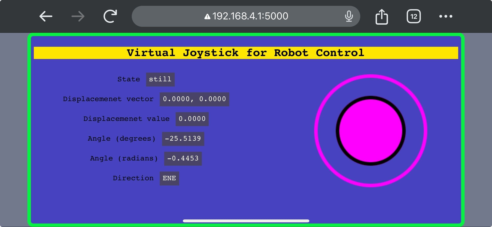

# Dev Update \#5

In this update, we built a complete example where ddbot is controlled wirelessly to move around by a web-based joystick. 

**Progress**. Basically two main things have been done.

- Reconfigured PWM-based motor control setup. We matched the rate voltage between motor (6V) and battery (12V) via PWM duty cycle adjustment to mitigate over-voltage risk, especially when motor reverses or brakes. Also introduced two modes for motor speed control: 'instant' (promptly update PWM signal) for responsive AI-driven applications and 'ramp' (gradually update PWM signal) for smoother human remote control scenarios.

- Enabled communication between robot and virtual joystick. We hosted a websocket server on ESP32 to allow fast data receiving from the webpage client, on where the joystick input is rendered and mapped to corresponded robot movement. This way we avoid compatibility with various gamepads and the joystick is equally accessible to any user with a mobile phone, tablet or PC device that has a web browser. 

Look at the demos where ddbot moved around under manual control and saw the world with its onboard camera, plus another episode with third-person-view record!

*ddbot teleoperation via web-based joystick (First-Person-View)*
")

*ddbot teleoperation via web-based joystick (Thrid-Person-View)*
")

*Joystick control panel*

**Plan**. We will update the tutorials for the example above on ddbot documentation website. Also, we will start to build the first AI example on ddbot: using deep learning and computer vision for ddbot collision avoidance.